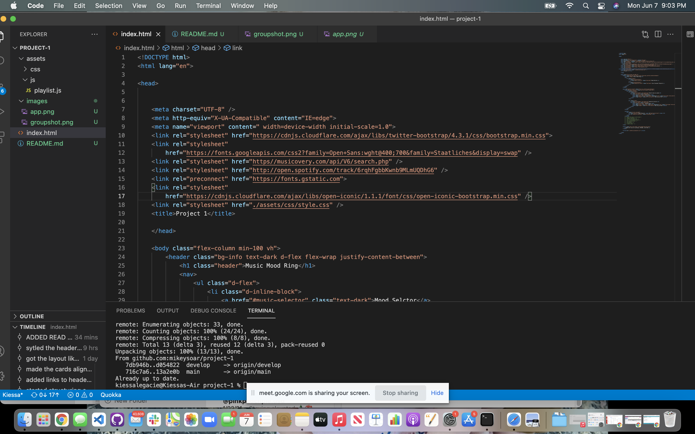
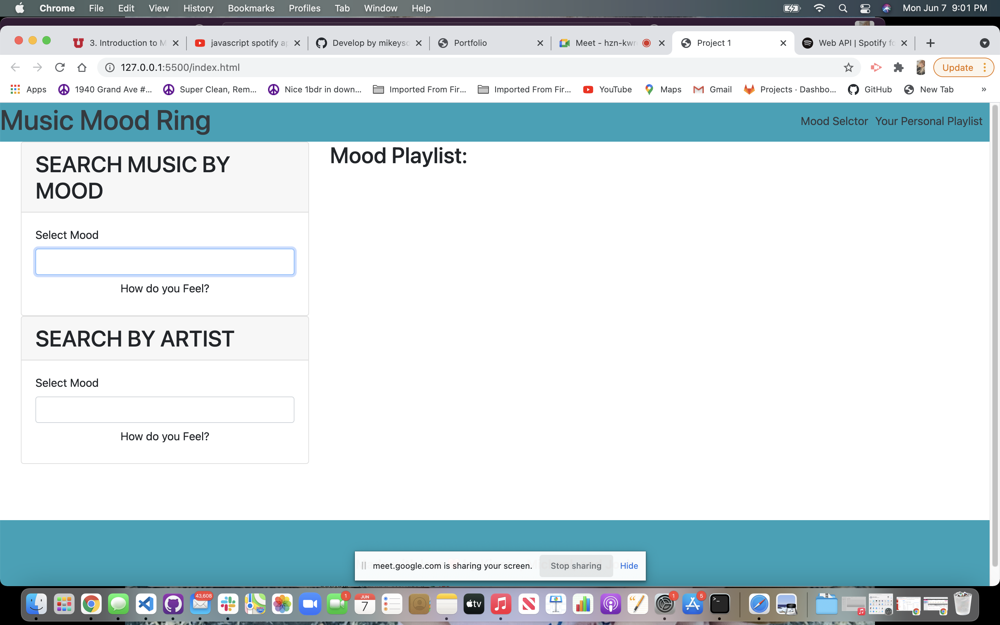
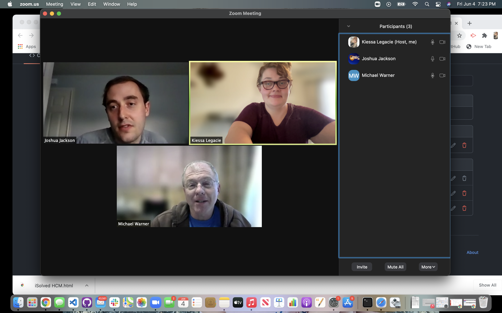
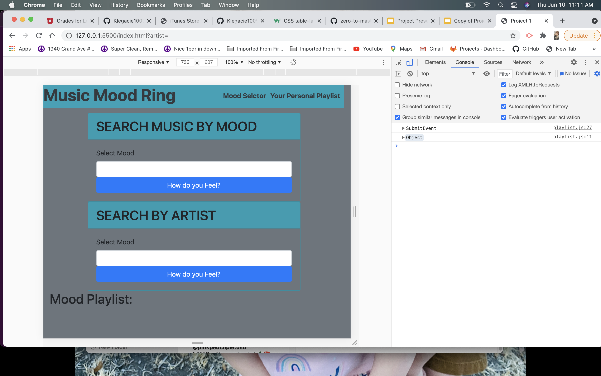

# Project-1

Kiessa, Michael and Josh 8:10 PM 06/07/21
> Mood Ring Music
---
### Table of Contents
- [Description](#description)
- [Introduction](#introduction)
- [Challenges](#challenges)
- [Victories](#victories)
- [Resources](#resources)

---

## Description
Challenge: Group project 1 using Web APIs

## Introduction 
Working as a team we created an app where users can choose their music playlist based of their mood or artist of their choosing.

--
Kiessa, Michael and Josh 8:25 PM
## Challenges
I think we collectively struggled with the initial Git process, being able to all make changes, push and pull. The javascript portion was also challenging to figure out. 
> Finding free APIs has been difficult.

---
## Victories
We easily constructed our HTML and CSS together and work very well together.
Our project is put togther and working by 06/09 for presentations.
Learning how to intigrade our APIs and getting them working.

---
The more we worked together the further we got!

---

Our favorite things about this project.
Josh - The HTML and CSS came very easily.
Michael - Working in collaboration and in a team.
Kiessa - My team-mates!

## Resources 

<a href="https://mikeysoar.github.io/project-1/">GitHub Repo</a>

<a href="https://www.google.com/">Google</a>

<a href="https://affiliate.itunes.apple.com/resources/documentation/itunes-store-web-service-search-api/">Itunes API</a>

<a href="https://binaryjazz.us/wp-json/genrenator/v1/story/">Binary Jazz API</a>

