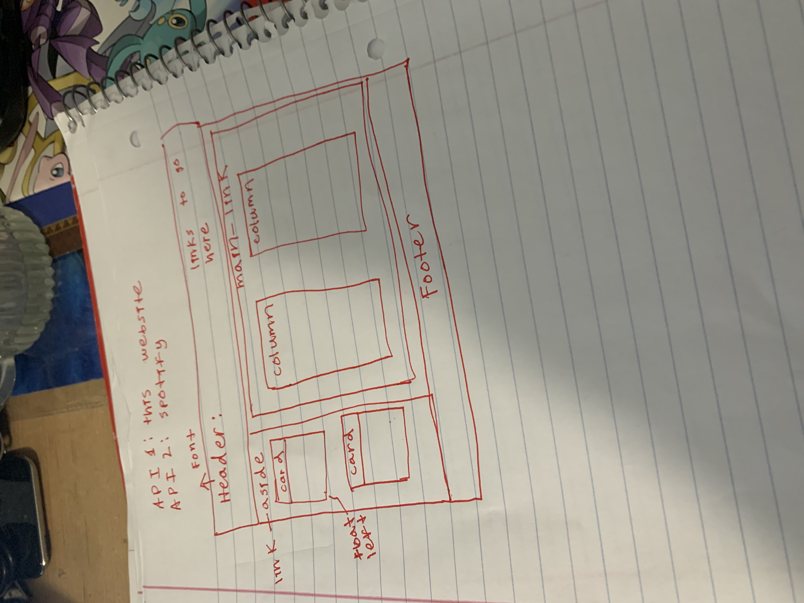

# Project-1

Kiessa, Michael and Josh 8:10 PM 06/07/21
> Artist's Songs and Music Stories
---
# Table of Contents
- [Application Description](#application-description)
- [Application Organization](#application-organization)
- [Running The Application](#running-the-application)
- [Challenges](#challenges)
- [Victories](#victories)
- [Technology Used](#technology-used)
- [Screenshot of Website](#screenshot-of-website)
- [Link to Appliation](#link-to-application)
- [Resources](#resources)

# Application Description
This was the first frontend project we did as a group where we had to use two urls to get data from two differnt websites. The members of our group were Michael, Kiessa, and I. We originally had the idea to make a website where people can search for songs from any artist based on their mood. Eventually we had to settle for a website that can look all the songs of a certian artist with a story generator due to difficulties of getting the information of the fetch requests to show up on the website. In conclusion the application originally tried to solve the problem of allowning a user to find any song to reflect what they were feeling, but evetnually turned into allowing the user to access any song they wanted to hear from a single artist. 

# Application Orgnaization
Each of us was given a specific role or job to do for the project because we had to code our website from the ground up. Kiessa was given the role of styling the applicaiton with CSS, Michael was given the role of creating the HTML for the webiste, and I was given the role of handling the Javascript that would make the fetch requests functional. All three of us were able to fulfill our foles for the first few days of getting the project done before we started running into complications. One complication were Kiessa becoming really busy with her schedule and not having lots of time to get her part done. The other complicaiton was Kiessa and Michael not being able to push their changes for the website onto the repostiory while I was the only one who was able to get his changes pushed up. Because of these complications I was given the responsiblity to act as the backup if Michael and Kiessa ever needed it. 

The layout we decided on for the website was having the cards with the searchbox on the lefthand side of the webiste. The boxes that conatianed the name of the songs and the random stories were put next to the search boxes. The header section has the title of the website with links to the songs and the randomly generated music stories. The footer section has all of our names along with the name of the hypothetical company we created this website for. 

# Running The Application:
To run this applicaiton on another computer software that needs to be installed on the computer if necessary is an internet browser like Google Chrome and Visual Studio Code. The links to download both of these are listed below
- <a href="https://www.google.com/chrome/">Google Chrome Download</a>
- <a href="https://code.visualstudio.com/docs/setup/setup-overview">Visual Studio Code Download</a>

The next step is to download the code from the group repository on github. Before cloning the code from the github repostiory make sure to have the terminal in visual studio code open. The terminal in visual studio code is where the repoistory will be cloned onto the other computer with a specific command. The link for the group repository is listed below.
- <a href="https://github.com/mikeysoar/project-1">Github Repository Link</a>
Click on the green code button at the top right corner to git the link needed to clone the repository in your visual studio code terminal. The link option you will want to choose is the https option because it does not require a security key. After Choosing the https option type the git clone command in your visual studio code terminal and double click to put the link to the repostiory after the git clone command. Hit enter to clone the code onto your computer. The index.html file needs to be selected before the webiste is loaded with an internet broswer. Right cliking in the index.html file will bring up a drop down menu with the option to open in default broswer. Select that option to make the webiste load in the web broswer on your computer.

# Challenges
I think we collectively struggled with the initial Git process, being able to all make changes, push and pull. The javascript portion was also challenging to figure out. 
> Finding free APIs has been difficult.

---
# Victories
We easily constructed our HTML and CSS together and work very well together.
Our project is put togther and working by 06/09 for presentations.
Learning how to intigrade our APIs and getting them working.

---
> Out line frame work.

---

---
The more we worked together the further we got!

---

Our favorite things about this project.
Josh - The HTML and CSS came very easily.
Michael - Working in collaboration and in a team.
Kiessa - My team-mates!

# Technology Used
The technology we used was Bootstrap, Javascript, JSON, HTML, and CSS

# Screenshot of Website

# Link to Application

<a href="https://mikeysoar.github.io/project-1">Application Link</a>

# Resources 

<a href="https://mikeysoar.github.io/project-1/">GitHub Repo</a>

<a href="https://www.google.com/">Google</a>

<a href="https://affiliate.itunes.apple.com/resources/documentation/itunes-store-web-service-search-api/">Itunes API</a>

<a href="https://binaryjazz.us/wp-json/genrenator/v1/story/">Binary Jazz API</a>

